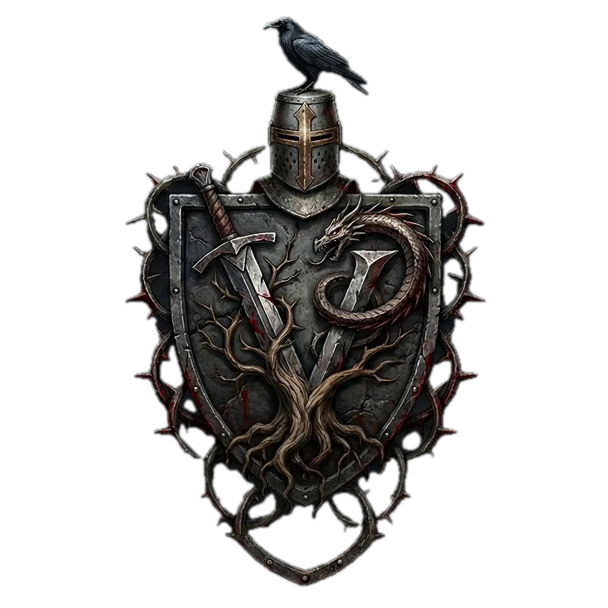

# Venture



Venture is a build tool for the Adventurer game engine, written in Go. It orchestrates the complete build pipeline from source code to distributable packages.

## What It Does

Venture automates the entire build process for Odin-based game projects:

1. **Lints** source code for console portability issues (checking for forbidden imports)
2. **Generates** Odin code from Protocol Buffer definitions
3. **Compiles** the Clay UI C library using clang
4. **Downloads/manages** Steamworks SDK libraries (when using Steam platform)
5. **Compiles** Odin source code with platform-specific settings
6. **Packages** everything into distributable archives with all dependencies bundled

## Installation

```bash
go install .
```

Move the `venture` binary to a location in your PATH, or run it from the project directory.

## Requirements

- Go 1.25.5 or later
- Odin compiler
- `protoc` (Protocol Buffers compiler)
- `protoc-gen-odin` (Odin protobuf plugin)
- `odinfmt` (Odin code formatter)
- `clang` (for compiling Clay C library)
- **macOS only**: `dylibbundler` (install with `brew install dylibbundler`)
- **Linux only**: `linuxdeploy` (download from https://github.com/linuxdeploy/linuxdeploy/releases)

### Level Editor Additional Requirements

The level editor uses CGAL for BSP tree collision detection:

- **CGAL** (Computational Geometry Algorithms Library)
  - macOS: `brew install cgal`
  - Linux: `sudo apt-get install libcgal-dev`
- **GMP** (GNU Multiple Precision library) - usually installed with CGAL

After installing CGAL, build the C++ wrapper library:

```bash
cd bsp/cgal
make
```

## Running

For development with `go run` (level editor):

```bash
./run.sh level levels/test.yaml
```

Or set the library path manually:

```bash
# macOS
export DYLD_LIBRARY_PATH="${DYLD_LIBRARY_PATH}:${PWD}/bsp/cgal"
go run . level levels/test.yaml

# Linux
export LD_LIBRARY_PATH="${LD_LIBRARY_PATH}:${PWD}/bsp/cgal"
go run . level levels/test.yaml
```

For the compiled binary:

```bash
# Build first
go build

# Run (library path still needed for level editor)
DYLD_LIBRARY_PATH="${PWD}/bsp/cgal" ./venture level levels/test.yaml
```

## Project Configuration

Venture expects a `venture.yaml` file at the root of your game project:

```yaml
# Project name
name: My Game

# Binary output name (without extension)
binary_name: my_game

# Steam App ID (optional, required for --platform steam builds)
steam_app_id: 480
```

## Commands

### `venture build`

Builds and packages the project for distribution on the current OS. **Cross-compilation is not supported** because bundling platform-specific shared libraries requires running on the target platform.

```bash
venture build [--platform PLATFORM] [--debug] [--release]
```

**Options:**
- `--platform, -p`: Storefront platform integration (`steam` or `fallback`, default: `fallback`)
- `--debug, -d`: Build with debug symbols
- `--release, -r`: Build with optimizations

**Build Pipeline:**
1. Lints `src/` directory for forbidden imports
2. Generates Odin code from `.proto` files in `proto/` directory
3. Compiles Clay C library from `vendor/clay/`
4. Downloads Steam libraries to `vendor/steamworks/redistributable_bin/` (if `--platform steam`)
5. Compiles Odin source with collection path set to `src/platforms/<platform>/`
6. Creates distributable package in `build/` directory

**Output Formats:**

- **macOS**: Zip archive (`<binary_name>-darwin_arm64.zip` or `darwin_amd64.zip`)
  - Contains: binary, `assets/`, and `libs/` with all shared libraries
  - Uses `dylibbundler` to bundle dependencies with `@executable_path/libs/` rpath
  
- **Linux**: Directory bundle (`<binary_name>-linux_amd64/`)
  - Contains: binary, `assets/`, `lib/` with all shared libraries, and `launch.sh` script
  - Uses `linuxdeploy` to bundle dependencies
  - Run via `launch.sh` which sets `LD_LIBRARY_PATH` correctly
  
- **Windows**: Zip archive (`<binary_name>-windows_amd64.zip`)
  - Contains: `.exe` binary, `assets/`, and all required DLLs
  - Automatically detects and includes common DLLs (SDL2, OpenAL, etc.)

**Examples:**
```bash
# Build for current platform with fallback
venture build

# Build with Steam integration and optimizations
venture build --platform steam --release
```

### `venture run`

Builds and immediately runs the project on the current platform. Intended for development workflow.

```bash
venture run [--platform PLATFORM] [--debug] [--release]
```

**Options:**
- `--platform, -p`: Storefront platform (`steam` or `fallback`, default: `fallback`)
- `--debug, -d`: Build with debug symbols
- `--release, -r`: Build with optimizations

**Behavior:**
1. Runs the same build pipeline as `venture build` (except packaging)
2. Copies binary to project root
3. Copies Steam library to project root (if `--platform steam`)
4. Sets `SteamAppId` environment variable from `venture.yaml` (if `--platform steam`)
5. Executes the binary from project root
6. Cleans up binary and Steam library after execution

**Examples:**
```bash
# Run with fallback platform
venture run

# Run with Steam and debug symbols
venture run --platform steam --debug
```

### `venture lint`

Scans Odin source files in `src/` for forbidden imports that prevent console portability.

```bash
venture lint
```

This command checks your source code against a list of imports that are not allowed for console builds (e.g., platform-specific APIs that won't work on consoles).

### `venture fmt`

Formats Odin source code in the `src/` directory using `odinfmt`.

```bash
venture fmt [--check]
```

**Options:**
- `--check`: Check formatting without modifying files (dry-run mode for CI)

## Project Structure

Venture expects your game project to follow this structure:

```
your-game-project/
├── venture.yaml          # Project configuration
├── src/                  # Odin source code
│   └── platforms/
│       ├── steam/        # Steam-specific code (collection)
│       └── fallback/     # Fallback platform code (collection)
├── proto/                # Protocol Buffer definitions (optional)
├── vendor/
│   ├── clay/             # Clay UI library source
│   └── steamworks/       # Steamworks SDK (if using Steam)
├── assets/               # Game assets (copied to distribution)
└── build/                # Output directory (created by venture)
```

## Architecture

Venture is organized into focused packages:

- **`cmd/`**: Command implementations (build, run, lint, fmt)
- **`project/`**: Project configuration loading (reads `venture.yaml`)
- **`platform/`**: Platform detection (darwin_arm64, linux_amd64, etc.)
- **`linter/`**: Import linting for console portability
- **`formatter/`**: Odin code formatting via `odinfmt`
- **`protobuf/`**: Protocol Buffer code generation
- **`clay/`**: Clay C library compilation with clang
- **`steamworks/`**: Steam library management and downloads
- **`odin/`**: Odin compiler orchestration
- **`packager/`**: Platform-specific packaging (uses build tags)

Commands in `cmd/` orchestrate these packages in a declarative, high-level way.

## Platform-Specific Notes

### macOS
- Requires `dylibbundler` to bundle shared libraries
- Creates zip archives with libraries in `libs/` subdirectory
- Binary uses `@executable_path/libs/` rpath to find dependencies

### Linux
- Requires `linuxdeploy` to analyze and bundle dependencies
- Creates a directory bundle with `launch.sh` script
- Launch script sets `LD_LIBRARY_PATH` to `lib/` subdirectory
- Does NOT create AppImage (creates directory bundle instead)

### Windows
- Automatically searches for common DLLs (SDL2, OpenAL, etc.)
- Places all DLLs next to the `.exe` in the zip archive
- Limited automatic dependency detection (may require manual DLL inclusion)

## Error Handling

All errors are wrapped with context using `fmt.Errorf`. Commands exit with non-zero status codes on failure, making them suitable for CI/CD pipelines.

## Development

Venture is built using the [Cobra](https://github.com/spf13/cobra) CLI framework and uses standard Go project structure.

To modify or extend Venture:

1. Add new functionality in the appropriate package
2. Wire it into the command pipeline in `cmd/`
3. Build tags are used for platform-specific packaging code
